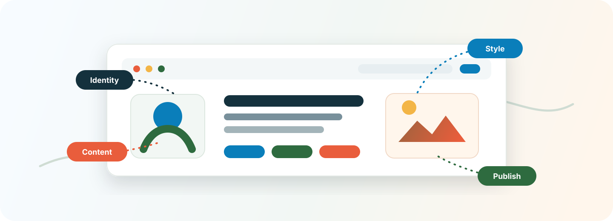

<p align="center">
  
</p>

<h1 align="center">Personal Homepage Builder</h1>

<p align="center">
  A Codex skill for turning identity, source materials, taste, and publishing constraints into a distinctive GitHub Pages friendly personal homepage.
</p>

<p align="center">
  <a href="https://github.com/hhhhao123/personal-homepage-builder"></a>
  
  
  
</p>

---

## What It Does

This repository includes the `personal-homepage-builder` skill in
`personal-homepage-builder/`. The skill can guide an agent through discovering a
person's identity, audience, source materials, visual direction, and publishing
constraints before building a GitHub Pages friendly personal homepage.

The skill may ask the agent to use other frontend or design skills, but it does
not automatically download, install, or force-enable those skills. For better
homepage design results, install the companion skills before using
`personal-homepage-builder`, then restart the agent so the new skills are picked
up.

Recommended companion skills:

| Skill | Why install it | Install / source |
| --- | --- | --- |
| `frontend-design` | Produces more distinctive, production-grade homepage UI instead of generic layouts. | [`npx skills add https://github.com/anthropics/skills --skill frontend-design`](https://www.skills.sh/anthropics/skills/frontend-design) |
| `theme-factory` | Helps create or apply consistent color and typography systems. | [`npx skills add https://github.com/anthropics/skills --skill theme-factory`](https://www.skills.sh/anthropics/skills/theme-factory) |
| `web-design-guidelines` | Provides a final UI, UX, and accessibility review pass. | [`npx skills add https://github.com/vercel-labs/agent-skills --skill web-design-guidelines`](https://www.skills.sh/vercel-labs/agent-skills/web-design-guidelines) |
| `web-artifacts-builder` | Useful only when the homepage is implemented as a complex React/Tailwind/shadcn artifact. | [`npx skills add https://github.com/anthropics/skills --skill web-artifacts-builder`](https://www.skills.sh/anthropics/skills/web-artifacts-builder) |
| `find-skills` | Helps users discover and install additional skills when the current set is not enough. | [`npx skills add https://github.com/vercel-labs/add-skill --skill find-skills`](https://www.skills.sh/vercel-labs/add-skill/find-skills) |
| `skill-installer` | Codex system skill for installing skills from curated lists or GitHub paths; usually already available in Codex. | [Source: `openai/skills`](https://github.com/openai/skills/tree/main/skills/.system/skill-installer) |

You can also browse the skill ecosystem at [`skills.sh`](https://www.skills.sh/).

## Install This Skill

```powershell
npx skills add https://github.com/hhhhao123/personal-homepage-builder --skill personal-homepage-builder
```

Restart the agent after installation so it can discover the new skill.

## Local Preview

If Ruby and Bundler are installed, run these commands in this project folder:

```powershell
bundle install
bundle exec jekyll build
```

The compiled website will be generated in `_site/`.

For a local preview server:

```powershell
bundle exec jekyll serve --host 127.0.0.1 --port 4000
```

Then open `http://127.0.0.1:4000`.
Keep that terminal open while previewing the site. Press `Ctrl+C` to stop the server.

The pages are also mostly static HTML, so `index.html` can be opened directly for a quick content check, though Jekyll template variables resolve only after a Jekyll build.

This project uses Jekyll 4 for local builds because newer Ruby versions are not compatible with the older Jekyll version pinned by the `github-pages` gem.

## Deploy to GitHub Pages

Create a public repository named:

```text
hhhhao123.github.io
```

Push this project to the repository's `main` branch. GitHub Pages will publish the site at:

```text
https://hhhhao123.github.io
```

If GitHub Pages is not enabled automatically, enable it in the repository settings using the `main` branch as the source.
